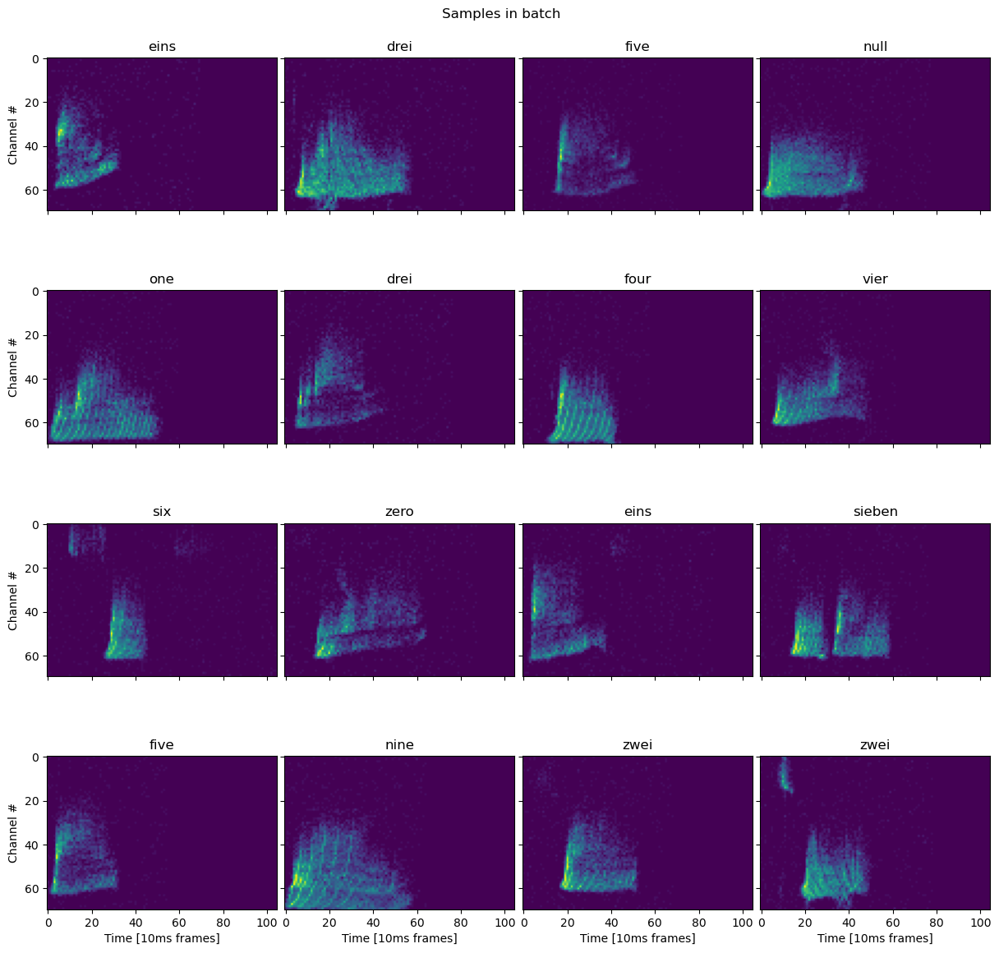

# Neuromorphic Computing for Spoken Digits Detection

Spiking Neural Network for classification of spoken digits using an event-based dataset.

<div style="text-align: center">
    
    <p style="text-align: center"> Figure 1: Samples of the spoken digits dataset </p>
</div>

## Setup

For the setup of the project follow the instructions in the [SETUP.md](docs/SETUP.md) file.

## Project Structure

```bash
│
├── artifacts                 # folders excluded from the repo, what you store here it won't be store in the repo
│     ├── data
│     └── models
│
├── src                      # source code folder for common code and for CRISP-DM steps
│     ├── common
│     ├── data_understanding
│     ├── data_preparation
│     ├── ...               
│     └── modelling
│
├── dev-requirements.txt     # testing dependencies
├── environment.yaml         # conda formatted dependencies, used by 'make init' to create the virtualenv
├── README.md                
└── requirements.txt         # core dependencies of the library in pip format
```
